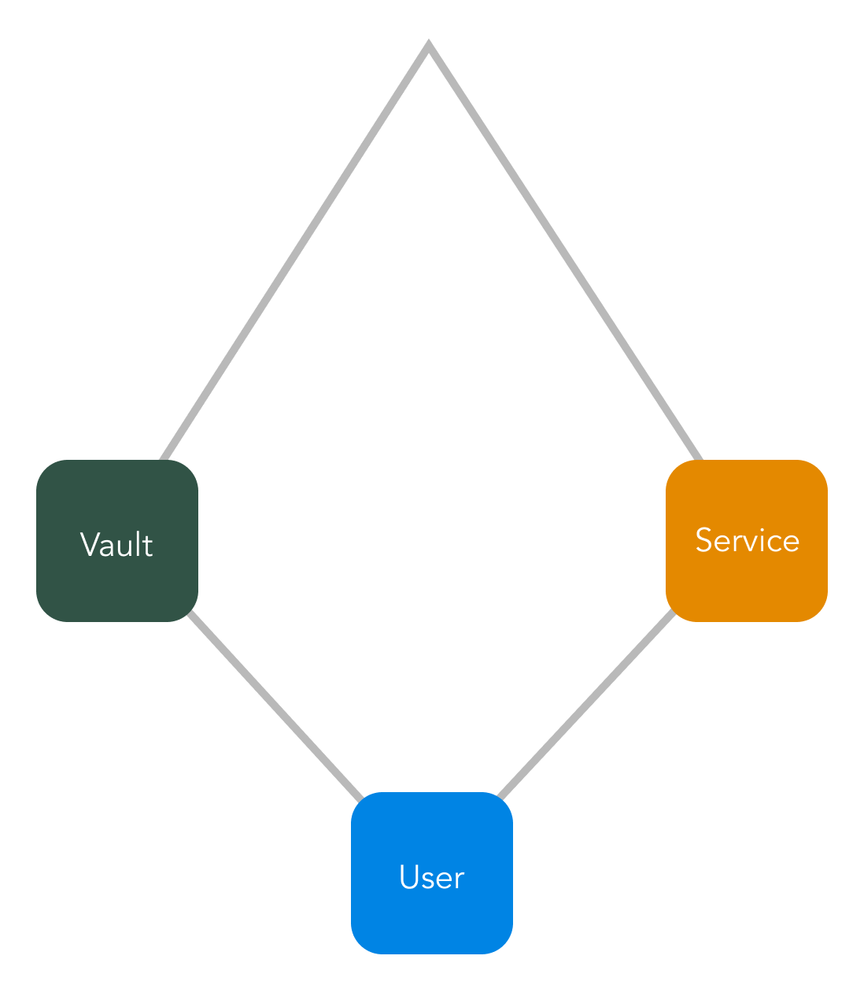

# Foundation

A wallet storage infrastructure system to eliminate the risks of a honey pot created by a centralised key storage. Foundation achieves this by spreading out the risk to three sites of interest

## Foundation Principles

1. user binding authentication through a simple interface with the vault,
2. service key pairs for obfuscating data,
3. a dedicated storage device (vault) for storing encrypted data only.

## How Foundation works

### Data exchange process

Wallet data is uploaded directly to the vault by the user after user binding authentication is created between the user and the vault. The binding should be facilitated by the service to ensure only service users are allowed to upload data to the vault under the service's bucket. The wallet data is to be encrypted using the provided service public key and therefore the vault is not privy to any information in the exchange

### Compromise Prevention

Using machine learning algorithms designed to capture patterns in the audit data suspicious activity can be communicated to the service provider and the user in question. This is similar to how credit card companies block transactions for out of routine transactions performed by the user.

## The Vision

The purpose of foundation is to enable a better customer experience for users without compromising on security. This is only possible if the service layer parties (the vault and the service) stick to the industry best practises when creating their respective platforms. Foundation is used to greatly decrease the risk of a custodian wallet.
