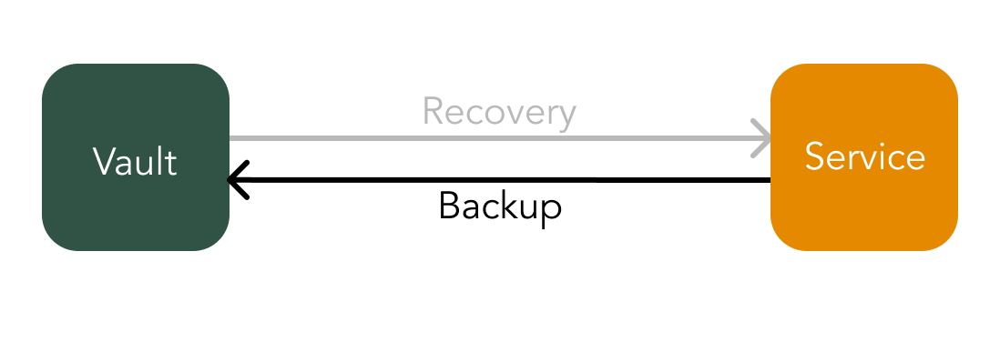

# Custodian Wallet

There are use cases where the service is ready to accept more risk. For these instances the vault can act as a simple secure storage using features such as IP white listing to reduce risk. The vault will still hold encrypted wallet data and the service will need to decrypt the data every time it pulls from the vault. The only specific difference is there is no need for user binding authentication since consent is not required from the user by the vault every time a service wants to use the wallet.

The service should still pull the user's wallet from the vault when it is required and destroy it afterwards. The service must hold its encryption keys securely while employing [regular key rotations](../general-information/faq.md#why-are-regular-key-rotations-of-a-services-keys-necessary).

## Risk mitigation

* Service IP white listing by the vault,
* access pattern checking,
* spreading out data required to access a wallet between two parties \(the vault and service\),
* regular service key rotations,
* the vault is not privy to wallet data and therefore is not a honey pot.

