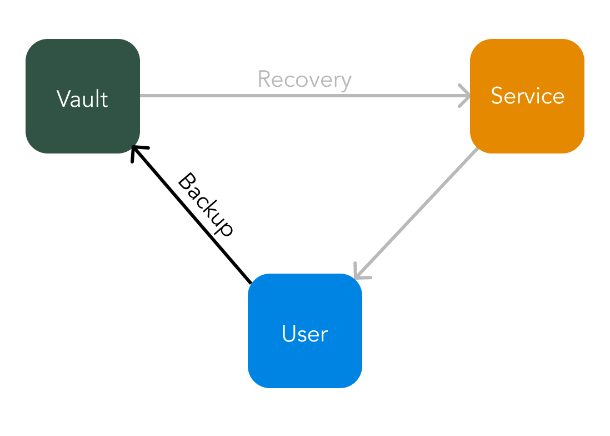

# Wallet Secure Storage

Foundation can be used for wallet recovery by holding encrypted wallet data in the vault. When recovering wallet data the service acts on the user's behalf to make a recovery request. The vault will authenticate the user\([Foundation Authentication](../technology/vault.md#foundation-authentication)\) via the service to ensure the user has given recovery consent to the service.

Wallet recovery will encompass using the [Wallet Retrieval](../technology/wallet-retrieval.md) process followed by sending the user the wallet so they can use it on their device. This process should be limited \(maybe once per week\) to ensure user's are not abusing the recovery feature and instead are in fact keeping their information safe and respecting the privacy and security requirements of a digital wallet.

## Risk mitigation

* Service IP white listing by the vault,
* prevent regular wallet recovery,
* service access audit log and access pattern checking,
* spreading out data required to access a wallet between two parties \(the vault and service\),
* the vault is not privy to wallet data and therefore is not a honey pot.

