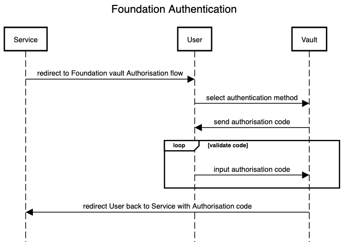

# Vault

The vault simply facilitates requests between the service and user when access to the wallet is required. There is still an inherent trust requirement between the service and user to ensure the user's wallet is used in good faith by the service. However, as long as bad actors can not access the encrypted wallets in the vault there is little use for compromised key pairs gained from services.

Vault facilitates the following activities:

1. Delegated Access
2. Wallet Secure Storage

All activities require the same authentication communication between the vault, user and service.

We also understand new standards are hard to adopt so it is up to the vault provider to provider services with easy to use interfaces as long as the underlying [Foundation Principles](../#foundation-principles) are satisfied.

## User Authentication

An authentication binding between the user and the vault is required before any user wallet data is stored on the vault \(as long as it is not a custodian wallet\).

The vault should only be accessed by service users to prevent random access attacks on the vault. Vault user creation therefore is facilitated by the service and a user will have a account in the vault for every service they use. This will involve setting up a authentication binding for each service.

### Foundation Authentication

The PKCE flow or traditional authorisation code flow should be considered for authorisation. However, instead of submitting the authorisation code to the `tokens` endpoint it should be used to retrieve the wallet instead.

