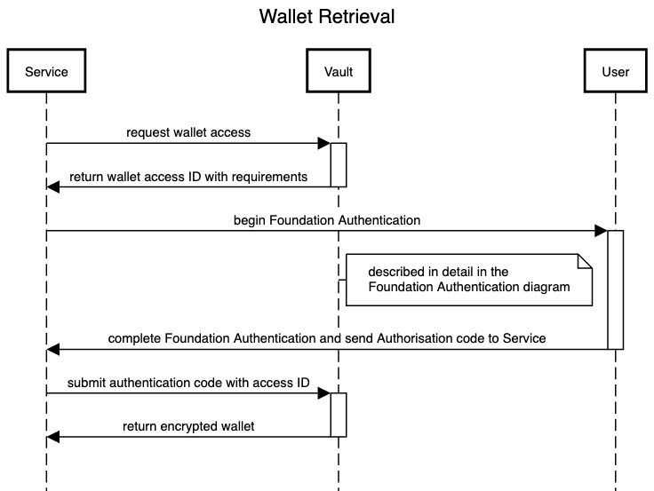

# Consented Wallet Retrieval

Wallet retrieval will need to be done every time a service needs to done something on behalf of the user using their wallet. This would typically involves things like signing blockchain transactions for transferring of digital assets. Since a service uses the vault as a secure storage medium it does not make sense for long lived access tokens to be held on the service side and instead the user should be asked to authenticate with the vault each time a wallet is retrieved. This also means the service should never store or log any information that can used to regenerate a user's wallet.

